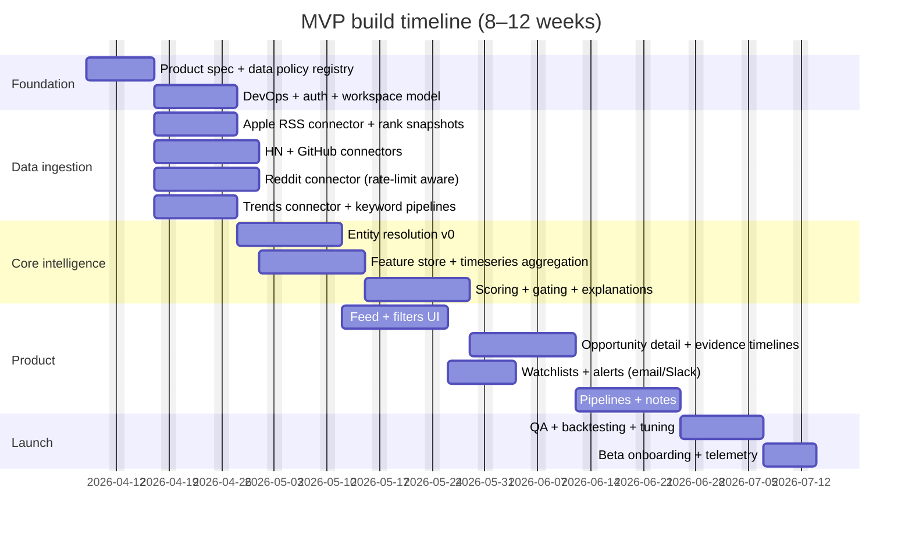

# Designing a High-Potential App Opportunity Discovery Platform

## Executive summary

This report designs a software/webapp that continuously discovers early-stage web/mobile app opportunities—especially products that are (a) beginning to trend and likely to broaden, or (b) “undermarketed”: unusually strong engagement/retention/enthusiasm relative to their current distribution reach. The core challenge is **forecasting** (what will go mainstream soon) under **data constraints** (rate limits, paid data, ToS restrictions) and **noise** (bot activity, hype cycles, seasonal effects). The recommended approach is a **hybrid** system: (1) multi-source ingestion + entity resolution, (2) trend/anomaly detection on time-series signals, (3) a transparent, explainable scoring model that separates *momentum* from *absolute traction* and explicitly estimates a *distribution gap*, and (4) a workflow-centric product UX for founders/PMs/investors (alerts, shortlists, collaboration, export). citeturn5search0turn5search3turn2search0turn2search13

A key feasibility finding: several target data sources either **require commercial licensing** or impose restrictions that materially affect an MVP. For example, the entity["company","Product Hunt","product launch platform"] API states it “must not be used for commercial purposes” by default (commercial use requires contacting them). citeturn7search7 entity["company","Crunchbase","company data platform"] access similarly depends on license type, and includes rate limits and contractual usage terms. citeturn7search14turn7search10turn0search6 Social sources have shifting constraints: the entity["company","X","social network"] API is credit-based pay-per-usage and rate-limited per endpoint. citeturn7search20turn2search0 The entity["company","Reddit","social platform"] Data API has free-tier rate limits and terms indicating commercial/research uses beyond permitted access may require a separate agreement. citeturn2search13turn2search29 TikTok’s “Research Tools” include a Research API but are explicitly positioned for qualifying researchers (geography/eligibility constraints), making it unreliable as a core commercial dependency. citeturn2search2turn2search6

Given these constraints, an MVP that is both compliant and valuable should prioritize: (1) **public ranking feeds** (e.g., Apple RSS top charts), (2) **developer/community signals** (HN, GitHub, Reddit within limits), (3) **search demand signals** (Google Trends API alpha), and (4) *optionally* one paid intelligence provider (Similarweb/Sensor Tower/data.ai/42matters) if budget allows. Apple provides an official RSS feed generator that includes Top Free/Paid apps feeds, which can serve as a compliant, repeatable “chart position velocity” signal. citeturn6view1turn6view0 Google introduced an official Trends API (alpha) with a rolling 1800-day window and data “up to just 2 days ago,” useful for early demand detection. citeturn3search3

Assumptions & unknowns (explicit):
- Budget for paid data (Similarweb/Sensor Tower/data.ai) is **unknown**; these are commonly sold as subscriptions/enterprise packages rather than commodity-priced APIs. citeturn2search7turn4view0turn0search2  
- Team size is **unknown** beyond “small team” (this report uses scenarios for 2–4 engineers plus part-time design/PM).  
- Whether commercial agreements can be obtained for Product Hunt / Reddit / other sources is **unknown** and changes the data plan substantially. citeturn7search7turn2search29  

## Target users and product requirements

The product should be designed as a **deal-flow / opportunity pipeline** rather than a generic “trend dashboard,” because founders, PMs, and investors need to turn signals into decisions.

Founders (indie → seed-stage)
- Need: identify app ideas with emerging demand; find “proof” that a niche is heating up; assess competition and differentiation; locate distribution weaknesses to exploit (ASO gaps, poor onboarding narrative, weak SEO, low social reach).
- Workflow: daily/weekly scan → shortlist → deep dive → build/ship.

PMs / growth leads (existing products)
- Need: category/trend monitoring; adjacency expansion; competitor move detection; “why now” briefs; integrations into internal tools.
- Workflow: monitor watchlists → alerts on anomalies → share briefs → take actions (experiment backlog, competitive response).

Investors / scouts
- Need: early signal on teams/products before large rounds; validate whether buzz is durable; map market clusters; track second-order effects.
- Workflow: pipeline triage → diligence packet → ongoing monitoring.

Non-negotiable product requirements
- Explainability (“why is this ranked?”) so users trust and act on results.
- Collaboration primitives (notes, tags, sharing, team workspaces).
- Export/integration (CSV, Slack/email, webhooks, CRM/Notion/Jira connectors) for downstream execution.
- Compliance guardrails (rate limiting, ToS-aware ingestion modes, auditability). citeturn0search0turn2search0turn2search13turn2search29

## Data sources and signal engineering

### Data sources to prioritize

The system should treat each source as producing:
1) **Entities** (app, company, domain, repo),  
2) **Events/observations** (post, mention, ranking snapshot, download estimate), and  
3) **Derived features** (velocity, acceleration, anomaly score, sentiment, engagement efficiency).

Below is a pragmatic prioritization focused on (a) likelihood of compliant access, (b) signal-to-noise ratio for “early trend,” and (c) ability to measure *distribution gap*.

| Source | What you can reliably extract | Access & constraints | Why it matters for “undermarketed + trending” |
|---|---|---|---|
| entity["company","Apple","consumer electronics company"] RSS Top Apps feeds | Top Free/Paid chart snapshots by storefront; chart rank velocity | Official RSS feeds and a feed generator; provides top paid/free app feeds citeturn6view1turn6view0 | Rank acceleration is a strong early market signal even when absolute installs are unknown |
| entity["company","Google","technology company"] Trends API (alpha) | Search interest time-series; emerging query/topic demand | Official Trends API announced; rolling 1800 days; data up to ~2 days behind citeturn3search3 | Captures early intent before installs/revenue show up |
| entity["organization","Hacker News","tech news site"] API | Top/new/best story lists; item metadata; updates feed | Public endpoints; base URI `https://hacker-news.firebaseio.com/v0/`; stated “no rate limit” in README citeturn13view0 | High-signal early adopter discussion; trend “seedbed” for dev/tech products |
| entity["company","GitHub","software hosting platform"] API | Repo stars/forks/issues velocity; release cadence; contributor activity | Documented rate limits (e.g., unauth 60 req/hr; GitHub Apps can be higher) citeturn1search2 | “Builder traction” and OSS adoption often precede mainstream productization |
| entity["company","Reddit","social platform"] Data API | Post/comment volume and engagement; subreddit-level momentum | Free access rate limits (100 QPM per OAuth client id); commercial use may require separate agreement citeturn2search13turn2search29 | Niche community traction; early evidence of product-market pull |
| entity["company","Similarweb","digital intelligence company"] API | App download/engagement estimates (depending on plan) | App downloads endpoint documented; notes iOS downloads may be limited (e.g., iOS downloads “currently only available for the USA” in one endpoint doc); API is a subscription add-on citeturn2search3turn2search7 | Provides a comparable cross-app “growth curve” proxy without being the app owner |
| entity["company","Sensor Tower","app market intelligence company"] data (via APIs/feeds) | Downloads/revenue estimates, rankings, alerts (product-dependent) | Officially markets API/data feeds with “metrics updated daily” and alerts/integrations (Slack/Salesforce/Snowflake) citeturn4view0 | Strong for mobile market velocity + competitor benchmarking (paid) |
| entity["company","Product Hunt","product launch platform"] API | Launch posts, upvotes, comments, collections (early “maker” traction) | GraphQL endpoint and rate limits: 6250 complexity points per 15 min; requires access token citeturn0search4turn0search0; **commercial use restricted by default** citeturn7search7 | Great launch signal, but only viable if commercial permission is obtained |
| entity["company","Crunchbase","company data platform"] API | Funding rounds, investors, headcount signals (depending on plan) | Rate limit documented (200 calls/min); access requires appropriate license; governed by license agreement citeturn0search6turn7search14turn7search10 | Helps separate “real companies with momentum” from hobby projects |
| entity["company","X","social network"] API | Post volume, engagement, network diffusion metrics | Rate limits are per endpoint; pricing is pay-per-usage credits citeturn2search0turn7search20 | High-velocity trend detection; but cost can scale quickly |
| entity["company","TikTok","short-form video platform"] Research API | Public content/account data for approved researchers | Research Tools described as for “qualifying researchers” in specific regions citeturn2search2turn2search6 | Viral trend discovery is powerful, but commercial access is structurally uncertain |

Additional sources (newsletters, VC blogs, founder blogs) should be ingested via RSS/HTML where permitted and stored as “content signals,” but they generally provide weaker quantitative traction. Apple explicitly maintains RSS capabilities and feed tooling, which can also be leveraged to ingest relevant ecosystem updates in a standardized way. citeturn6view1

### Signal types and how to operationalize them

To find “high potential with low traction,” you need signals that explicitly distinguish **absolute popularity** from **rate-of-change**, and signals that estimate **distribution efficiency**.

Momentum & velocity signals (trend onset)
- **Rank velocity / acceleration**: Δrank/day and Δ²rank/day for app-store charts (e.g., from Apple RSS top 25/top 10 feeds). citeturn6view1  
- **Mention velocity**: z-scored growth in mentions across HN/Reddit/X in rolling windows; watch for “burst” structure. Burst-detection is a classic formalization for emerging topics in streams. citeturn5search0  
- **Change-point probability**: Bayesian online change-point detection can flag regime shifts in time-series as soon as they happen. citeturn5search3turn5search7  
- **Seasonality-adjusted anomaly scores**: seasonal ESD-style approaches (and related robust anomaly detection practices) can reduce false positives from weekly cycles. citeturn5search17  

Engagement quality signals (“real pull” vs hype)
- **Engagement per impression proxy**: comments/upvotes ratios on launch feeds; comment depth on HN; reply depth on Reddit.
- **Sentiment + intent**: NLP extraction of “I need this / switching / paying” intent vs “cool demo” chatter (topic + sentiment features).

Distribution gap signals (“undermarketed”)
- **High engagement with low audience size** (where audience size is measurable): strong engagement per follower/account age; strong thread depth in small subreddits.
- **Search demand > product visibility**: rising Google Trends interest paired with low chart rankings or weak SEO footprint. citeturn3search3turn6view1  
- **Weak packaging signals**: unclear positioning, poor store listing quality, low review count relative to usage signals (requires estimates or proxies).

Fundamentals signals (durability)
- **Funding / investor quality / recency** (via licensed databases).
- **Builder execution**: GitHub commit cadence and contributor diversity; HN “Show” launches that keep shipping updates. citeturn1search2turn13view0  

Monetization signals (ability to “execute better”)
- Evidence of willingness-to-pay in comments; presence of pricing pages; subscription language; review content referencing paid tiers.

## Scoring, ranking, and explainability

### Recommended scoring philosophy

A single scalar score should be decomposable into sub-scores so users can filter by what they care about (founders vs investors differ). The minimum viable scoring model should be a **transparent additive model** (weighted features) with **hard gates** and **evidence traces**. ML can be layered later for learning-to-rank.

Recommended sub-scores (0–100 each)
- **Momentum**: “how fast is it changing?”  
- **Engagement Quality**: “is the attention meaningful?”  
- **Distribution Gap**: “is it unusually strong given its reach?”  
- **Fundamentals**: “is there evidence this is durable?”  
- **Market Tailwinds**: “is demand rising broadly?” (e.g., Google Trends) citeturn3search3  
- **Execution Feasibility**: “can we realistically build/market a better version?”

### Metrics, normalization, thresholds

Normalization should be robust because all sources are heavy-tailed:
- Counts (mentions, upvotes) should be log-transformed (e.g., log1p).  
- Cross-source comparability should be done via percentile ranks by category/source.  
- Time-series features should be evaluated in consistent windows (e.g., 7d, 14d, 30d) and include seasonality handling where relevant. Seasonal anomaly detection methods explicitly decompose seasonality and evaluate residual outliers, which is useful for “trend spike” alerts. citeturn5search17  

Hard gates (example MVP defaults)
- Momentum percentile ≥ 90th in its category AND
- Minimum evidence coverage: ≥ 2 independent sources show positive momentum (e.g., Apple chart + Reddit, or HN + Trends). citeturn6view1turn13view0turn3search3  
- Anti-spam: exclude obvious inorganic patterns (sudden mentions from zero-to-many with no conversational depth).

Weighting (initial heuristic; tune via backtesting)
- Momentum 35%  
- Distribution Gap 25%  
- Engagement Quality 20%  
- Market Tailwinds 10%  
- Fundamentals 10%

These weights should be calibrated using:
- Backtests against historical “breakout” products (define breakout via later sustained chart rank or sustained download estimate where licensed data exists).
- Human-in-the-loop labeling: “would you have acted on this?” for top-N suggestions.

### Explainability: “Why this opportunity?”

Every ranked item should show:
- A **timeline** of key signals (rank movement, mention spikes, search interest) with the methods used (burst/anomaly/change-point tags). citeturn5search0turn5search3turn6view1turn3search3  
- A **score breakdown** (feature contributions) and clear negative factors (“high volatility,” “single-source spike,” “low engagement depth”).  
- Evidence cards linking to the underlying observations (HN threads, Reddit posts, chart snapshots) for auditability. HN supports an updates endpoint and top/new story lists that can be stored as evidence. citeturn13view0  

If/when ML ranking is introduced, use explainability methods appropriate for tree-based models (e.g., SHAP-style local attribution) to preserve trust; this reduces “black box” objections without preventing model improvements.

## Architecture and tech stack options

### Real-time vs batch: what’s actually required

A practical hybrid:
- **Near-real-time (minutes)** for high-velocity social/community sources when affordable/available (Reddit, HN updates, X if budgeted). HN’s Firebase-based API supports update observation as a first-class concept. citeturn13view0  
- **Batch (hourly/daily)** for charts, app intelligence, and licensed databases (Apple RSS feeds, Similarweb/Sensor Tower exports, Crunchbase updates). Apple sales/trends style analytics reports are available with daily/weekly/monthly schedules for developers’ own apps, illustrating that “daily batch” is common for marketplace reporting even when not used for cross-app discovery. citeturn0search19turn0search15  
- **Batch + anomaly detection** is sufficient for an MVP that aims for *actionable weekly opportunity discovery*, not second-by-second trading.

### Ingestion patterns: APIs first, crawling only when compliant

Design ingestion connectors as “policy-aware” modules:
- Rate limiting is non-negotiable: entity["company","Product Hunt","product launch platform"] has both complexity-based and request-based limits (e.g., 6250 complexity points per 15 minutes for GraphQL). citeturn0search0 entity["company","GitHub","software hosting platform"] documents strict REST API rate limits (e.g., unauthenticated 60 requests/hour). citeturn1search2 entity["company","Reddit","social platform"] free Data API rate limits are explicitly documented (100 QPM per OAuth client id). citeturn2search13 entity["company","X","social network"] emphasizes per-endpoint limits and 429 responses. citeturn2search0  
- Contract gating: a commercial product must treat certain sources as “disabled until licensed,” e.g., Product Hunt’s stated non-commercial default. citeturn7search7  
- Prefer official feeds/APIs where possible (Apple RSS feeds, HN API, GitHub API). citeturn6view1turn13view0turn1search2  

### ML/NLP components: trend detection + semantic understanding

Trend detection (MVP → V2)
- MVP: robust z-score velocity + simple change-point heuristics.
- V2: formal burst detection for event streams (Kleinberg) citeturn5search0 and Bayesian online change-point detection for early regime shifts. citeturn5search3  
- Seasonal anomaly detection for “spike alerts” where seasonality matters. citeturn5search17  

NLP for sentiment/topic extraction
- Topic modeling / embedding clustering for categorization and “adjacency” recommendations.
- Sentiment + intent classification tuned to “buying intent / switching intent” rather than generic polarity.

### Stack options and trade-offs

| Layer | Option A (fast MVP) | Option B (scale-focused) | Notes |
|---|---|---|---|
| Backend API | FastAPI (Python) | Go / Java + gRPC | Python accelerates data/ML iteration |
| Data pipeline | Cron + task queue | Airflow/Prefect + queues | Prefer simple scheduler initially; expand when connectors grow |
| Storage | Postgres + object store | Postgres + ClickHouse/BigQuery | Time-series/event analytics can outgrow OLTP quickly |
| Search | Postgres full-text + vector | OpenSearch/Elastic + vector | Needed for discovery UX and semantic search |
| Queue/stream | Redis queues | Kafka/Pulsar | Only needed if near-real-time ingestion is core |

For small teams, Option A is usually the right MVP bet; Option B becomes relevant once you add multiple high-volume sources and strict SLAs.

## Product UX, collaboration, and APIs

### Discovery UX: key screens and flows

The UI should resemble a “deal discovery + diligence” product:

1) **Opportunity Feed (Ranked)**
- Filters: category, platform, geography, “undermarketed” threshold, momentum window (7/14/30d).
- Each card: score, delta rank, delta mentions, “evidence count,” and a one-sentence “why now.”

2) **Opportunity Detail**
- Signal timeline charts: chart rank velocity (from Apple RSS, etc.), mention volume, search interest.
- “What’s happening” auto-summary + extracted claims (“users complain about X,” “pricing opportunity Y”).
- Competitive snapshot (known alternatives detected by co-mentions and store similarity).

3) **Workspace / Pipeline**
- Kanban stages: Inbox → Shortlist → Investigate → Build Candidate → Archived.
- Notes, @mentions, tasks, and attachments.

4) **Alerts**
- Watchlist alerts: “momentum crossed threshold,” “new funding,” “new spike in search.”

image_group{"layout":"carousel","aspect_ratio":"16:9","query":["trend analytics dashboard UI","startup deal flow pipeline dashboard UI","product opportunity discovery dashboard wireframe","competitive intelligence SaaS dashboard UI"],"num_per_query":1}

### Sample wireframe (text-based)

```text
[Top Nav]  Opportunities | Watchlists | Pipelines | Sources | Settings

[Opportunity Feed]
---------------------------------------------------------------
[Score 92]  "X"  Category: Productivity  Stage: Early Trend
Signals:  Apple rank ↑↑  |  HN mentions ↑  |  Trends ↑
Why now:  Rank acceleration + intent-heavy discussions
[Open] [Save] [Add to Pipeline]
---------------------------------------------------------------
[Score 88]  "Y"  Category: Finance  Stage: Undermarketed
Signals:  Reddit depth ↑↑ | GitHub stars ↑ | Low SEO footprint
Why now:  High engagement per small audience
[Open] [Save] [Add to Pipeline]

[Right Sidebar]
Watchlists:  AI agents, Personal finance, B2B devtools
Alerts:  3 new spikes today
```

### Recommended core features (MVP baseline)

Data ingestion & entity resolution
- Source connectors with policy-aware rate limiting and backoff.
- Entity resolution that maps: app store ID ↔ domain ↔ repo ↔ social handles.

Signals & scoring
- Rolling time-series store for each metric.
- Score computation + stored “score explanations.”

Alerts
- Threshold crossings (momentum, distribution gap).
- Digest emails + Slack webhook notifications.

Collaboration
- Teams/workspaces, notes, tags, pipeline stages.
- “Diligence pack” export (PDF/Markdown/Notion-ready).

Export & integration
- CSV export of opportunities + features.
- Webhooks (new opportunity, score change).
- Optional integrations (Slack, Notion, Jira, CRM).

### Recommended data schemas (conceptual)

Key tables (relational core + event store):
- `entity` (app/product/company/persona-level object)
- `source_account` (source + credentials + plan + quotas)
- `observation` (raw event or snapshot; immutable)
- `metric_timeseries` (entity_id, metric_name, t, value)
- `feature_snapshot` (entity_id, as_of, feature_vector_json)
- `score_snapshot` (entity_id, as_of, total_score, sub_scores, explanation_json)
- `watchlist` / `watchlist_entity`
- `alert_rule` / `alert_event`
- `workspace` / `user` / `membership`
- `pipeline` / `pipeline_item` / `note` / `task`

A critical modeling choice: keep raw observations immutable for auditability and explainability (users need to click through to “why”). HN’s API and updates feed make this pattern especially natural. citeturn13view0

### API endpoints (REST-first MVP)

```http
GET  /v1/opportunities?category=&stage=&min_score=&sort=&time_window=
GET  /v1/opportunities/{id}
GET  /v1/opportunities/{id}/timeseries?metric=&window=
POST /v1/opportunities/{id}/save
POST /v1/pipelines/{pipeline_id}/items
GET  /v1/watchlists
POST /v1/watchlists
POST /v1/alerts/rules
GET  /v1/alerts/events
POST /v1/exports/opportunities.csv
POST /v1/webhooks
GET  /v1/sources/status
```

For enterprise customers, add a “bulk export” endpoint that materializes feature/score snapshots into a warehouse-friendly format (Parquet/CSV). This mirrors how intelligence vendors position scheduled feeds for warehouse ingestion. citeturn4view0

## Privacy, legal, and data-governance constraints

### Source licensing and ToS compliance (engineering implications)

This product’s biggest existential risk is **data access instability**.

- Product Hunt: API documentation states the API “must not be used for commercial purposes” by default and asks commercial users to contact them. That means an MVP should not silently build a commercial dependency without an agreement. citeturn7search7  
- Reddit: Data API Terms explicitly point commercial purposes or usage beyond expressly permitted access toward a separate agreement, and rate limits are documented for free eligibility. citeturn2search29turn2search13  
- X: pricing is pay-per-usage and rate limits are per-endpoint; budget controls and quota enforcement need to be first-class in the architecture. citeturn7search20turn2search0  
- Crunchbase: API access and usage are governed by license agreement terms and plan type, with documented rate limits. citeturn7search10turn0search6turn7search14  
- TikTok: Research API access is positioned for qualifying researchers, so relying on it for a commercial core pipeline is high-risk. citeturn2search2turn2search6  
- Apple RSS feeds: Apple publicly lists RSS feeds including top free/paid apps and provides a feed generator; this is a comparatively stable, low-risk input for chart-based signals. citeturn6view1turn6view0  

Engineering mitigations
- Ship with a **source policy registry**: per-source allowed methods (API/RSS), licensing state, quotas, and redlines.
- Maintain **data provenance tags** (source, time, endpoint, token used, rate-limit headers).
- Add “kill switches” per source to avoid cascading failures.

### Privacy law baseline (user + contributor data)

Even if the product primarily ingests public/market data, it will still process:
- User account data (emails, OAuth tokens, team membership).
- Potentially personal data embedded in posts/comments (e.g., usernames).

Therefore:
- GDPR principles: EU guidance emphasizes technology neutrality and that personal data is subject to GDPR protections regardless of medium. citeturn14search2  
- Core GDPR principles include lawfulness/fairness/transparency and constraints on purpose limitation. citeturn14search20turn14search0  
- California: the California Attorney General summarizes that CCPA gives consumers more control over personal information collected by businesses and provides implementation guidance via regulations. citeturn14search1turn14search3  

Practical privacy/security controls (MVP)
- Data minimization: store only what you need for scoring and explainability; define retention windows (e.g., raw social text retained 90 days, aggregates retained longer).
- Token hygiene: encrypt secrets at rest; rotate; least privilege; audit access.
- User-facing transparency: a clear privacy policy explaining sources and retention.

The Apple Analytics Reports API also highlights a privacy-aware design pattern (“granular data… while still preserving privacy”), reinforcing that privacy-preserving aggregation is a standard for marketplace analytics products. citeturn0search15  

## Go-to-market, MVP roadmap, KPIs, and risks

### Go-to-market and monetization strategies

Positioning: “Opportunity intelligence for builders” (founders/PMs) with an optional “scout mode” for investors.

Monetization model (recommended)
- SaaS subscription per seat + workspace tiers:
  - Starter: limited sources, daily digest, basic scoring.
  - Pro: advanced filters, pipelines, exports, webhooks.
  - Team: collaboration + integrations.
  - Enterprise: warehouse feeds, SSO, dedicated data licenses.

A second monetization axis is **data add-ons**:
- Users connect their own paid providers (Similarweb/Sensor Tower/Crunchbase) via bring-your-own-key licensing, which can reduce your re-distribution obligations and cost exposure (subject to each provider’s terms). Similarweb explicitly frames API access as a subscription add-on. citeturn2search7 Sensor Tower advertises APIs/feeds and enterprise integrations (Snowflake/Slack/Salesforce), implying “enterprise data plumbing” as a monetizable tier. citeturn4view0

### MVP scope, prioritized roadmap, and effort estimates

A compliant MVP should avoid licensing dead-ends and prove that the scoring + UX creates repeatable “aha” moments.

**MVP (8–12 weeks)**
- Sources: Apple RSS top charts + HN + GitHub + Reddit (within free limits) + Google Trends API alpha.
- Features: ranked feed, opportunity detail pages with timelines, watchlists + email/Slack alerts, pipelines, CSV export, admin source status dashboard. citeturn6view1turn13view0turn1search2turn2search13turn3search3

**Phase 2 (4–8 additional weeks)**
- Add one paid intelligence source (Similarweb or Sensor Tower) if budgeted.
- Add richer NLP and entity resolution (domain ↔ app ↔ repo).
- Add webhooks + CRM/Notion integration.

**Phase 3**
- Commercial agreements for Product Hunt / Crunchbase / expanded Reddit access; learning-to-rank model.

Effort/complexity table (small team)

| Feature | Priority | Complexity | MVP effort (time) | Notes |
|---|---:|---:|---:|---|
| Ingestion connectors (Apple RSS, HN, GitHub, Reddit, Trends) | P0 | Med | 2–4 wks | Rate limits + stability are main risk citeturn6view1turn13view0turn1search2turn2search13turn3search3 |
| Entity resolution (domain/app/repo mapping) | P0 | High | 2–4 wks | Drives dedup + cross-source scoring quality |
| Trend engine (velocity + anomaly + gates) | P0 | Med | 2–3 wks | Can start heuristic; later adopt burst/change-point citeturn5search0turn5search3turn5search17 |
| Scoring + explainability UI | P0 | Med | 2–3 wks | Must ship with “why this” evidence views |
| Discovery UX (feed + detail + filters) | P0 | Med | 3–5 wks | User trust depends on drill-down |
| Watchlists + alerts (email/Slack/webhooks) | P0 | Low–Med | 1–2 wks | Slack/webhooks can be minimal first |
| Collaboration (pipelines, notes, tagging) | P1 | Med | 2–4 wks | Critical for retention/teams |
| Paid providers (Similarweb/Sensor Tower) | P1 | High | 3–6 wks | Contract + integration overhead citeturn2search7turn4view0 |
| Commercial-source licensing (PH/Crunchbase/etc.) | P2 | High | variable | Depends on agreements; PH default non-commercial citeturn7search7turn7search10 |

Rough MVP cost/time ranges (small team; excludes data licenses)
- Time: ~8–12 weeks for a P0 MVP; ~12–20 weeks to include Phase 2 items.
- Cost: widely variable; for 2–4 engineers, expect a six-figure build cost in most markets (salaries/contracting/overhead), plus infrastructure and any paid data subscriptions. (Exact budget is an **unknown**; numbers depend heavily on hiring model and paid data choices.)

### MVP build timeline (Mermaid Gantt)



### KPIs and validation experiments

Primary KPIs (MVP)
- **Activation**: % of users who save ≥ 3 opportunities and create ≥ 1 pipeline within first week.
- **Weekly retention**: % returning weekly to review new opportunities.
- **Alert effectiveness**: open/click rate for digests; % of alert-driven sessions.
- **Precision proxy**: human-rated usefulness of top-N opportunities (e.g., “would you investigate/build?”).
- **Latency & coverage**: percentage of entities with ≥2 sources contributing signals; ingestion freshness SLAs (source-dependent). citeturn13view0turn6view1turn3search3

Validation experiments
- Backtest: run scoring on historical windows and measure whether surfaced items later achieved sustained chart presence or sustained demand (define objectively via chart persistence and/or licensed download estimates).
- “Founder panel” studies: weekly review sessions scoring top 20 opportunities (labeling dataset for model tuning).
- A/B scoring: compare different weight regimes (e.g., momentum-heavy vs distribution-gap-heavy) and measure downstream saves and “investigate” actions.

### Key risks and mitigations

Data access risk (highest)
- Risk: ToS restrictions, licensing limits, API pricing/rate-limit changes break ingestion. X pricing is explicitly pay-per-usage and rate-limited, and Product Hunt is non-commercial by default. citeturn7search20turn2search0turn7search7  
- Mitigation: data policy registry + modular connectors; diversify sources; ship value even if a single source disappears.

False positives / hype cycles
- Risk: short-lived spikes (bots, drama) outrank durable trends.
- Mitigation: multi-source confirmation gates; seasonality-aware anomaly detection; change-point + persistence scoring. citeturn5search17turn5search3turn5search0

Bias toward tech/dev audiences
- Risk: HN/GitHub overweight developer tools vs consumer apps.
- Mitigation: incorporate search demand (Trends) and app-store charts; add consumer social sources if licensing allows. citeturn3search3turn6view1

Explainability debt
- Risk: users won’t trust rankings without “why.”
- Mitigation: immutable observations + evidence cards + score decomposition.

Privacy/compliance drift
- Risk: storing user content/comments without clear purpose/retention increases legal exposure.
- Mitigation: explicit retention policies; minimization; GDPR/CCPA-aligned consumer rights processes if applicable. citeturn14search20turn14search1turn14search3